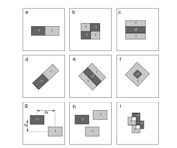
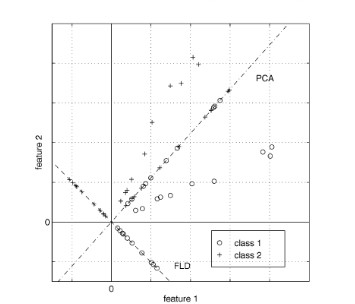
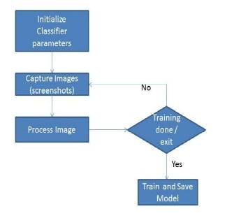
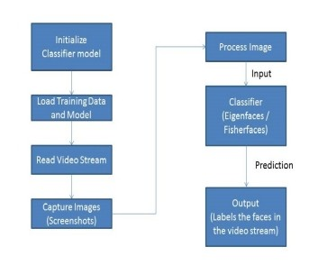
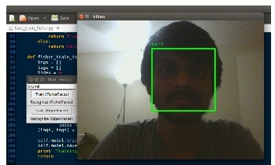
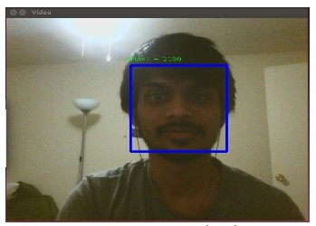
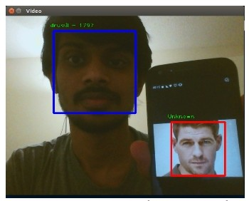
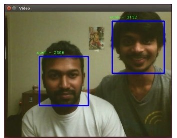

# **Real Time Face Detection and Recognition**

The project is a real time face detection and recognition application for Linux systems. You can run a simple script, train the model to learn faces and then test it out on multiple faces. The application uses webcam stream for the recognition purpose, so make sure the computer or laptop you try it on has a webcam.

## **Methods**

## 1. Face Detection

### **Haar-like features**

Haar-like features can be seen as an over comprehensive set of 2-D Haar functions that are used to convert local presence of objects. They comprise of a few rectangular regions bounded in a template. These features are used detect face in the webcam stream.

Fig. 1.  Haar-like features having base weights, (a) and (b) show Haar-like features proposed by Papageogiou et. al. (c) shows a Haar-like feature introduced by Viola and Jones

### **Cascade Calssifier**

A cascade classifier works on Haar-like features. The cascade classifier used for the project is from the opencv library which works on Haar-like features proposed by Viola and Jones. The classifier first needs to be trained with images containing specific objects like faces or car or ball, that are scaled to same size, for example (20 x 20 pixels) and negative samples which could be any other random images.After a classifier is trained it can be used to detect objects that it saw trained for. 

## 2. Face Recognition

### **Eigenfaces**

One of the most popular techniques used in computer vision for dimensionality reduction is Principal Component Analysis (PCA). Principal Component Analysis is also known as Karhunen-Loeve method, where a dimension is reduced by linear projection that aims to maximize the spread of all given data points.

### **Fisherfaces**

Fisher’s Linear Discriminant (FLD) is an example of a class specific method, in the sense that it tries to shape the scatter in order to make it more reliable for classification. It tries to minimize the ratio of the between-class and the within-class scatter.

Fig. 2. Contrast between PCA and FLD for a 2 class classification problem, where points lie near a linear subspace.

## **Models and Flow Diagrams**

Fig. 3. Flow diagram for Face Detection and training using Eigen faces and Fisher faces classifiers.

Fig. 4. Flow diagram for Face Recognition using Eigenfaces and Fisherfaces classifiers.

## **Using the Application**

	Run the Main.ipnyb file using ipython notebook to launch the GUI of the applications (use the following command):
	ipython notebook Main.ipnyb

	For Training:
		Input a name in the text-box
		and click on training either using eigenfaces or fisherfaces

	For Recofnition:
		Click on recognition either using eigenfaces or fisherfaces.

## **Results**

1. The face detection system works for different lighting situations (dark surroundings and well lit surroundings). It also works with different facial expressions.

2. Following are results of the application:

Fig. 4. Face Recognition using Fisherfaces.

Fig. 5. Face Recognition using Eignefaces.

Fig. 6. Face Recognition on multiple faces using Eigenfaces. (One Trained face, one untrained (labeled as *Unkown*)).

Fig. 7. Face Recognition on multiple faces using Fisherfaces. (Two Trained faces).

## **References**

1. [Haar-like features](Video-based Face Recognition: A Survey. Huafeng Wang, Yunhong Wang: International Journal of Computer, Electrical, Automation, Control and Information Engineering Vol:3, No:12, 2009)
2. [Haar-like features and Cascade Classifier](Robust Real-Time Face Detection. Paul Viola, Michael Jones: International Journal of Computer Vision 57(2), 137–154, 2004)
3. [Eigenfaces](https://en.wikipedia.org/wiki/Eigenface)
4. [Fisherfaces](http://www.scholarpedia.org/article/Fisherfaces)